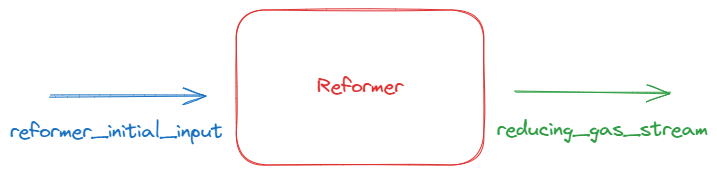
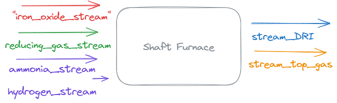

# Midrex ND plant with addition of ammonia and hydrogen input 
In this example we will calculate the heat requirement considering midrex reformer and shaft furnace in a Midrex Natural Gas Plant by utilizing stream objects.

## Reformer and Shaft Furnace in Midrex Reactor

The MIDREX Reformer plays a crucial role in the production of direct reduced iron (DRI) in the MIDREX Shaft Furnace. In the Shaft Furnace, iron oxide reacts with a hot gas containing H2 and CO, resulting in the reduction of iron oxide into metallic iron (Fe), with CO2 and H2O as byproducts. The MIDREX Reformer heats and catalytically reforms natural gas, recycling CO2 and H2O from the reduction process to generate a rich reducing gas for DRI production. The Reformer also recycles byproducts and unreacted gases to minimize energy consumption and provide the necessary energy for reduction reactions in the Shaft Furnace.

-> Assumptions have been made to streamline the model, taking into account only a subset of the components of the Midrex Furnace due to the complex nature of the process.

-> In this model, the process gas extracted from the top gas is not recycled into the reformer. Instead, a fixed gas composition is introduced into the reformer. However, the energy contribution from the shaft furnace, referred to as "Top Gas Fuel," has been incorporated into the energy balance equations.

## Requirements
### Python packages:
* chemapp>826
* pandas
* numpy
* Jupyter/IPython/...

### Databases
* FSstel

Note that the database may be replaceable with databases available to you,
however, some of the phase names likely need to be adapted, and the results will
not be numerically identical.

# Create equilibrium reaction calculator for the reformer 

In a simplified reformer`Stream Reformer` is heated up to an elevated `temperature`. An initial composition of a gas mixture `reformer_initial_input` is provided to reformer. As output `reducing_gas_stream` is obtained to be fed into the `Shaft Furnace`.

In previous code block, "Stream Reformer `reformer_initial_input` temperature is set to 580°C. Below, we will provide a reaction temperature that will also be equal to the output `reducing_gas_stream` temperature.

## Create equilibrium reaction calculator for the shaft furnace

In a simplified scenerio Shaft furnace is operated at a certain temperature. `reducing_gas_stream` that obtained from Reformer is provided to the Shaft Furnace as well as the hematite ore is fed to the furnace at ambient conditions (25°C,1 bar) by `iron_oxide_stream`. Moreover, to reduce the CO2 emissions, `ammonia_stream` and `hydrogen_stream` is fed to the furnace in a desired ratio. As output `stream_top_gas` and `stream_DRI` is obtained.1/3 of the  gas stream will be used for energy conversation, whereas the 2/3 will be utilized in `Reformer`. The latter solid srteam contains the direct reduced iron, with a certain metallization degree.   

## Final remarks
 Calculate the energy required to supply considering the recovered heat from off-gas, and consumed energy based on reaction dH of reformer and shaft furnace.An overview of the stream management and process flowchart for current process model is in Results section.

